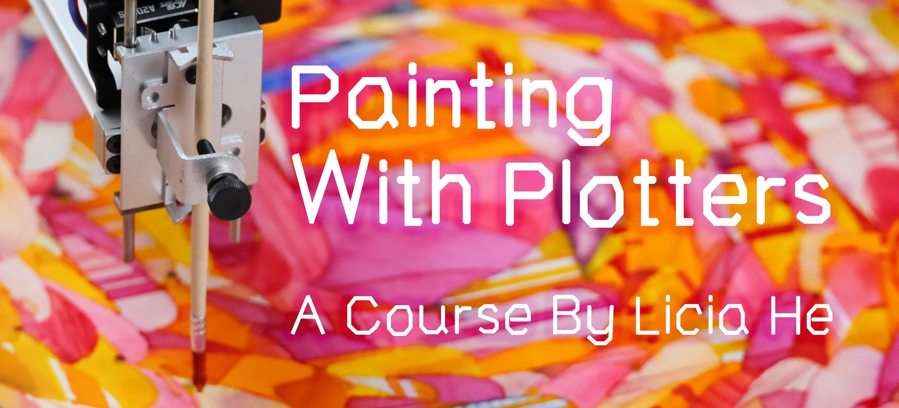

# [Painting with Plotters](https://www.eyesofpanda.com/project/painting_with_plotters/)

## About this Course

**Painting With Plotters** is a virtual course that introduces Licia He's method for making generatively-designed, plotter-rendered paintings using a variety of water-based paint. 

This repository will host all the materials (code, image etc.) used for this course. Please head to the [**Course Website**](https://www.eyesofpanda.com/project/painting_with_plotters/) for the full content. 

## News/Updates

- 2024-Dec : Course Launch! 
- 2024-Sep : [Special Event At the Victoria and Albert Museum](https://www.vam.ac.uk/event/bJvmGKbB9/painting-with-plotters-sep-2024)
- 2024-Sep *(planned/FAILED)*: Course release
- 2024-Jun *(planned/FAILED)*: Video production 
- 2024-May: The course website is online 
- 2024-Jan: Pre-course survey is online. Thanks filling the survey!!!! I will try to incorporate points raised there into the class.   
- 2024-Jan: The Q&A article is online.

### License: 
#### Media (images and videos):
Unless otherwise mentioned, ALL RIGHTS RESERVED. 
#### Code and Notes:
Unless otherwise mentioned, code and notes in this repository are under MIT license: 

Copyright (c) [2024] [Shiqing He]

Permission is hereby granted, free of charge, to any person obtaining a copy of this software and associated documentation files (the "Software"), to deal in the Software without restriction, including without limitation the rights to use, copy, modify, merge, publish, distribute, sublicense, and/or sell copies of the Software, and to permit persons to whom the Software is furnished to do so, subject to the following conditions:

The above copyright notice and this permission notice shall be included in all copies or substantial portions of the Software.

THE SOFTWARE IS PROVIDED "AS IS", WITHOUT WARRANTY OF ANY KIND, EXPRESS OR IMPLIED, INCLUDING BUT NOT LIMITED TO THE WARRANTIES OF MERCHANTABILITY,FITNESS FOR A PARTICULAR PURPOSE AND NONINFRINGEMENT. IN NO EVENT SHALL THE AUTHORS OR COPYRIGHT HOLDERS BE LIABLE FOR ANY CLAIM, DAMAGES OR OTHER LIABILITY, WHETHER IN AN ACTION OF CONTRACT, TORT OR OTHERWISE, ARISING FROM, OUT OF OR IN CONNECTION WITH THE SOFTWARE OR THE USE OR OTHER DEALINGS IN THE SOFTWARE.